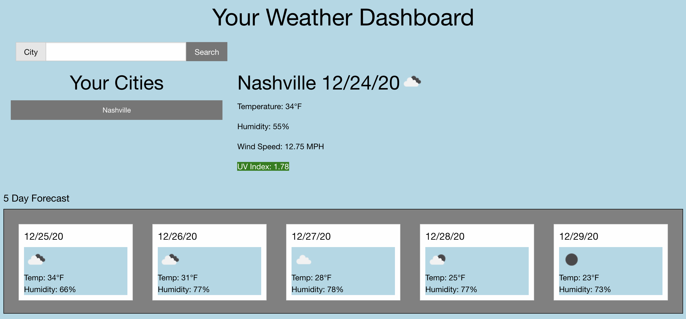

# Weather-Dashboard
A Weather application that allows the user to view the current and forecasted weather for various cities.

This application is now live and deployed at: https://clatrobe00.github.io/Weather-Dashboard/

This application is a simple weather dashboard that uses the OpenWeatherAPi to call for the weather forecast in searched cities. The dashboard displays the city's name, current conditions for temperature, humidity, wind speed, and UV levels. The dashboard also displays a five day forecast for the searched city. The application loads a default city initially- in this case, Nashville, TN.

This application saves searched cities to the localstorage and then creates a button in the sidebar for each city. Clicking on the city again will cause that city's weather forecast to display. This application will automatically display the most recent search on page refresh. Additionally, this application has functionality to filter out mispelled cities and duplicate cities.

